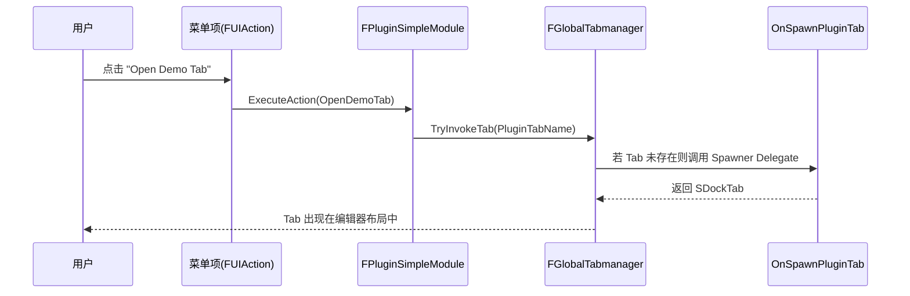

# PluginSimple：UE 插件加载与 Tab/菜单注册流程

本文以本仓库的 `PluginSimple` 为例，说明 UE（Unreal Editor）在启动时如何发现并加载插件模块，以及该模块如何注册一个可停靠（Dockable）的 Nomad Tab，并把入口挂到编辑器主菜单栏。

## 1. 关键文件与角色

- 插件描述文件（决定“是否是插件/有哪些模块/何时加载”）：[PluginSimple.uplugin](file:///workspace/Plugins/PluginSimple/PluginSimple.uplugin#L1-L24)
- 模块构建规则（决定“编译时依赖哪些模块”）：[PluginSimple.Build.cs](file:///workspace/Plugins/PluginSimple/Source/PluginSimple/PluginSimple.Build.cs#L1-L28)
- 模块入口（决定“加载后做什么/卸载前清什么”）：[PluginSimple.cpp](file:///workspace/Plugins/PluginSimple/Source/PluginSimple/Private/PluginSimple.cpp#L14-L46)

对照示例（同仓库的另一个插件，展示不同 `LoadingPhase` 的写法）：[ShadertoyUE.uplugin](file:///workspace/Plugins/ShadertoyUE/ShadertoyUE.uplugin#L17-L23)

## 2. UE 插件加载总流程（从发现到 StartupModule）

### 2.1 插件发现（Discovery）

UE 会在启动时扫描若干插件目录（引擎插件目录、项目插件目录等），并读取其中的 `.uplugin` 来构建插件清单。本仓库的插件均位于：

- `Plugins/*/*.uplugin`（例如 [PluginSimple.uplugin](file:///workspace/Plugins/PluginSimple/PluginSimple.uplugin#L1-L24)）

`.uplugin` 的核心价值在于提供模块描述（Module Descriptor）。以 `PluginSimple` 为例：

- 模块名：`PluginSimple`（决定要加载/编译的模块名）[PluginSimple.uplugin](file:///workspace/Plugins/PluginSimple/PluginSimple.uplugin#L17-L23)
- 模块类型：`Editor`（仅在编辑器目标下加载）[PluginSimple.uplugin](file:///workspace/Plugins/PluginSimple/PluginSimple.uplugin#L17-L23)
- 加载阶段：`Default`（在引擎规定的默认阶段加载）[PluginSimple.uplugin](file:///workspace/Plugins/PluginSimple/PluginSimple.uplugin#L17-L23)

对照 `ShadertoyUE`，其加载阶段是 `PostEngineInit`： [ShadertoyUE.uplugin](file:///workspace/Plugins/ShadertoyUE/ShadertoyUE.uplugin#L17-L23)

### 2.2 模块加载（Load）与入口回调（StartupModule）

当 UE 进入某个加载阶段（Loading Phase），会遍历该阶段需要加载的模块描述并交给模块系统加载。典型链路可以概括为：

1. 读取 `.uplugin` 得到模块描述（Name/Type/LoadingPhase）
2. 到达对应 `LoadingPhase` 时，模块系统请求加载该模块
3. 加载模块二进制并构造模块对象
4. 调用 `IModuleInterface::StartupModule()` 执行模块启动逻辑

对 `PluginSimple` 来说，第 4 步对应 [FPluginSimpleModule::StartupModule](file:///workspace/Plugins/PluginSimple/Source/PluginSimple/Private/PluginSimple.cpp#L14-L31)。

### 2.3 为什么 LoadingPhase 很重要

很多“注册 UI”的行为（菜单、Tab、样式、命令等）对引擎/编辑器模块的初始化顺序敏感：

- `Default`：较早的通用阶段，适合做“不会依赖编辑器主框架已完全就绪”的注册
- `PostEngineInit`：引擎初始化完成后，适合做更依赖编辑器子系统（例如更稳定地确保某些模块已就绪）的注册

`PluginSimple` 选择 `Default`，并在 `StartupModule` 内用 `LoadModuleChecked("LevelEditor")` 主动拉起依赖模块，从而把“时序不确定性”收敛到模块系统内部（要么成功、要么直接 assert 失败）：[PluginSimple.cpp](file:///workspace/Plugins/PluginSimple/Source/PluginSimple/Private/PluginSimple.cpp#L21-L31)。

## 3. PluginSimple：Tab 与菜单注册调用链

### 3.1 模块入口与生命周期

`PluginSimple` 的模块入口由宏声明（让模块系统能找到该模块并实例化）：

- [IMPLEMENT_MODULE(FPluginSimpleModule, PluginSimple)](file:///workspace/Plugins/PluginSimple/Source/PluginSimple/Private/PluginSimple.cpp#L113)

生命周期的两端：

- 启动： [FPluginSimpleModule::StartupModule](file:///workspace/Plugins/PluginSimple/Source/PluginSimple/Private/PluginSimple.cpp#L14-L31)
- 关闭： [FPluginSimpleModule::ShutdownModule](file:///workspace/Plugins/PluginSimple/Source/PluginSimple/Private/PluginSimple.cpp#L33-L46)

### 3.2 注册 Nomad Tab（Spawner 注册）

在启动阶段，模块向 `FGlobalTabmanager` 注册一个 Nomad Tab Spawner：

- 注册点： [PluginSimple.cpp](file:///workspace/Plugins/PluginSimple/Source/PluginSimple/Private/PluginSimple.cpp#L16-L20)
- 关键参数：
  - `PluginTabName`：Tab 的全局 ID [PluginSimple.cpp](file:///workspace/Plugins/PluginSimple/Source/PluginSimple/Private/PluginSimple.cpp#L12-L12)
  - `FOnSpawnTab`：真正“创建 Tab 内容”的回调 `OnSpawnPluginTab`
  - `ETabSpawnerMenuType::Hidden`：不让它自动出现在默认的 Window/Workspace 菜单里（入口由我们自己提供）[PluginSimple.cpp](file:///workspace/Plugins/PluginSimple/Source/PluginSimple/Private/PluginSimple.cpp#L16-L20)

Spawner 的实现是：

- [FPluginSimpleModule::OnSpawnPluginTab](file:///workspace/Plugins/PluginSimple/Source/PluginSimple/Private/PluginSimple.cpp#L48-L60)

### 3.3 往编辑器主菜单栏挂入口（MenuBar Extender）

`PluginSimple` 不使用 ToolMenus，而是使用较传统的 `FExtender` + `LevelEditor` 菜单可扩展点：

1. 创建 Extender，并声明要扩展菜单栏：
   - [PluginSimple.cpp](file:///workspace/Plugins/PluginSimple/Source/PluginSimple/Private/PluginSimple.cpp#L21-L27)
   - 扩展挂点：`"Help"` 之后、`EExtensionHook::After`
   - 扩展回调：`AddMenuBarExtension`
2. 将 Extender 注入 `LevelEditor` 的菜单扩展管理器：
   - [PluginSimple.cpp](file:///workspace/Plugins/PluginSimple/Source/PluginSimple/Private/PluginSimple.cpp#L29-L30)

在 `AddMenuBarExtension` 回调里，向菜单栏添加一个下拉菜单（PullDown）：

- [FPluginSimpleModule::AddMenuBarExtension](file:///workspace/Plugins/PluginSimple/Source/PluginSimple/Private/PluginSimple.cpp#L62-L70)

下拉菜单的内容由 `FillPulldownMenu` 填充（添加 2 个 menu entry）：

- [FPluginSimpleModule::FillPulldownMenu](file:///workspace/Plugins/PluginSimple/Source/PluginSimple/Private/PluginSimple.cpp#L72-L87)

### 3.4 点击菜单到打开 Tab：完整调用链

下面用序列图概括从“点击菜单项”到“Tab 实例化”的过程：

对应代码：

- 菜单项绑定 `OpenDemoTab`： [PluginSimple.cpp](file:///workspace/Plugins/PluginSimple/Source/PluginSimple/Private/PluginSimple.cpp#L74-L79)
- 执行 `TryInvokeTab`： [FPluginSimpleModule::OpenDemoTab](file:///workspace/Plugins/PluginSimple/Source/PluginSimple/Private/PluginSimple.cpp#L89-L92)
- Tab 创建回调： [FPluginSimpleModule::OnSpawnPluginTab](file:///workspace/Plugins/PluginSimple/Source/PluginSimple/Private/PluginSimple.cpp#L48-L60)

### 3.5 点击菜单到打开独立窗口：调用链

第二个菜单项会创建一个独立 `SWindow` 并交给 Slate：

- 菜单项绑定 `OpenDemoWindow`： [PluginSimple.cpp](file:///workspace/Plugins/PluginSimple/Source/PluginSimple/Private/PluginSimple.cpp#L81-L86)
- 创建窗口 + `FSlateApplication::AddWindow`： [FPluginSimpleModule::OpenDemoWindow](file:///workspace/Plugins/PluginSimple/Source/PluginSimple/Private/PluginSimple.cpp#L94-L111)

### 3.6 关闭/卸载时的清理（避免悬挂扩展与重复注册）

`ShutdownModule` 做两件事：

1. 从 `LevelEditor` 移除菜单 Extender（避免 Editor 退出时触发悬挂回调）：
   - [PluginSimple.cpp](file:///workspace/Plugins/PluginSimple/Source/PluginSimple/Private/PluginSimple.cpp#L35-L43)
2. 反注册 Tab Spawner（避免热重载/重复加载时注册冲突）：
   - [PluginSimple.cpp](file:///workspace/Plugins/PluginSimple/Source/PluginSimple/Private/PluginSimple.cpp#L45-L45)

## 4. 编译依赖与可移植性说明

`PluginSimple` 之所以能访问 `LevelEditor` 的菜单扩展点，原因是模块构建规则中声明了 `LevelEditor` 为私有依赖：

- [PluginSimple.Build.cs](file:///workspace/Plugins/PluginSimple/Source/PluginSimple/PluginSimple.Build.cs#L16-L24)

这类 `Editor` 插件在运行时只会被 Editor 目标加载（`.uplugin` 的 `Type: "Editor"`）：[PluginSimple.uplugin](file:///workspace/Plugins/PluginSimple/PluginSimple.uplugin#L17-L23)

